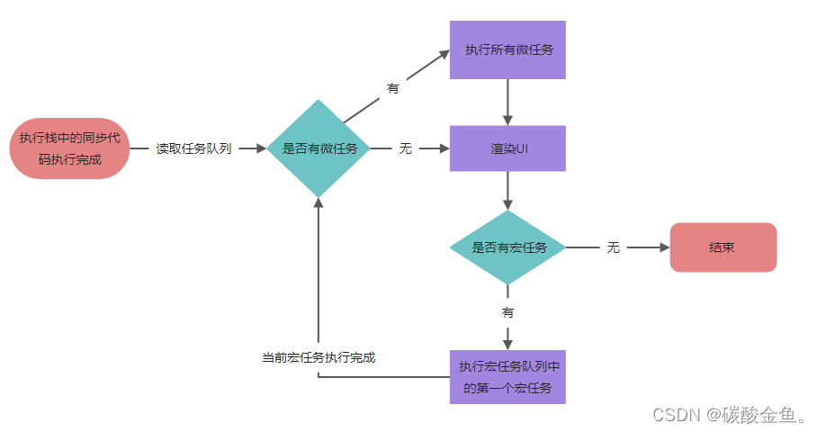

### js的原型链

### js的基本数据类型有那些?

基本数据类型一共有6种。  
1.String  
2.Number  
3.Boolean  
4.Null    
5.Undefined  
6.Symbol（Es6新增的类型）

### js的事件循环

1. 主线程开始执行一段代码, 假设开始执行一个 script 标签内的代码，将代码放入执行栈中执行，同步代码优先执行，执行过程中，当遇到任务源时，判断是宏任务还是微任务
2. 如果是宏任务，加入到宏任务队列中，如果是微任务，加入到微任务队列中
3. 同步代码执行完成，执行栈空闲，检查微任务队列中是否有可执行任务，如果有，依次执行所有微任务队列中的任务。如果没有。当前任务执行结束。
4. 渲染UI
5. 检查宏任务队列是否有可执行的宏任务，如果有，取出队列中最前面的那个宏任务，加入到执行栈中开始执行，然后重复 步骤1- 5。直到宏任务队列中所有任务执行结束  
   

### 宏任务包含：

1. script(整体代码)
2. setTimeout
3. setInterval
4. I/O
5. UI交互事件
6. postMessage
7. MessageChannel
8. setImmediate(Node.js 环境)

### 微任务包含：

1. Promise.then
2. Object.observe
3. MutationObserver
4. process.nextTick(Node.js 环境)